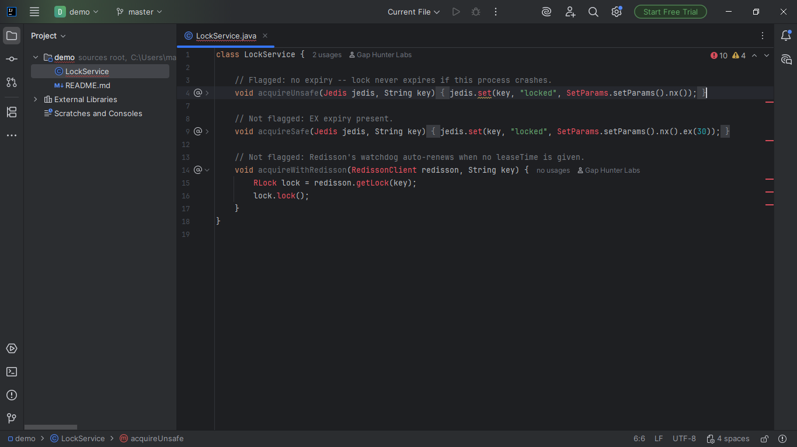
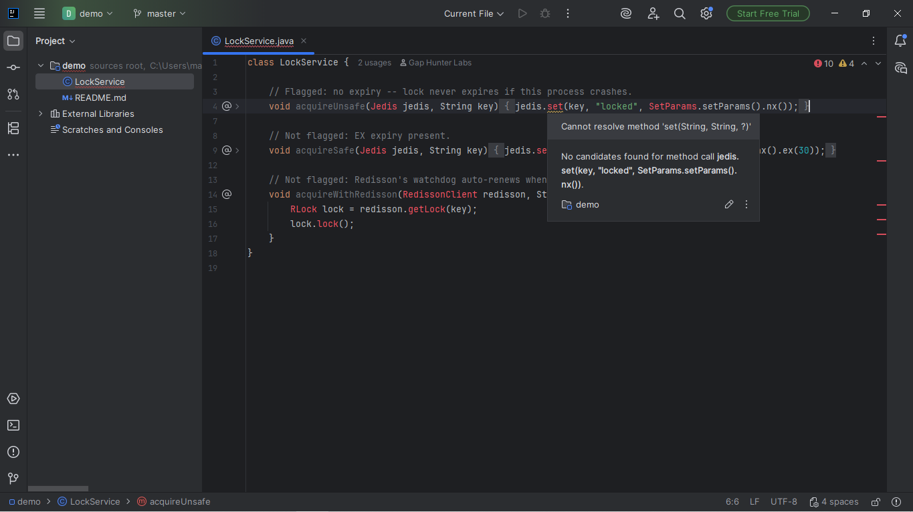

# Redis/Redisson Distributed Lock Missing TTL Companion

Warning on a `SET ... NX` call (Jedis's `SetParams.nx()`/Lettuce's
`SetArgs.Builder.nx()` manual distributed-lock pattern) with no
`EX`/`PX` expiry chained onto the same builder.

## Screenshots





## Why it exists

A lock acquired this way never expires on its own if the process
holding it crashes before releasing it, permanently blocking the
resource for every other caller -- a documented risk in Redisson's own
distributed-lock guide.

## Why built this way

**Redisson is explicitly considered, and deliberately never flagged**
for its own plain `RLock.lock()` (no `leaseTime` argument) -- Redisson's
own watchdog mechanism automatically renews the lock while the holder
is alive precisely BECAUSE no lease time was given. Flagging that shape
the same way as Jedis/Lettuce's SET NX would be a real, wrong false
positive -- resolving which concrete client is behind the call is the
real mechanism here, same discipline as `redisson-client-reuse-companion`
(this catalog, a different angle: client-instance reuse, not TTL).

## v0.1 scope — stated honestly, not exhaustively

Matches by text within the `.set(...)` call's own argument -- never
resolves the real client type (an unrelated `SetParams`/`SetArgs`-named
class from a different library is a possible, rare false positive).
Never follows an expiry value passed in from a variable computed
elsewhere -- only detects total absence of the expiry method call in
the same argument's text.

## Usage

Open any Java file using Jedis or Lettuce. A `SET ... NX` call with no
`EX`/`PX` chained shows a warning on the call.

## Support

- **Bugs and feature requests:** [GitHub Issues](https://github.com/GapHunterLabs/redis-lock-missing-ttl-companion/issues)
- **Questions, or custom rules for a team's codebase:** **gaphunterlabs@gmail.com**
- **Security vulnerabilities:** report privately as described in [SECURITY.md](SECURITY.md), not in a public issue.
- **Privacy and network behavior:** [PRIVACY.md](PRIVACY.md)

## Development

```
./gradlew test           # unit tests
./gradlew buildPlugin    # generates build/distributions/*.zip
./gradlew verifyPlugin   # checks compatibility against real IDEs
```

## License

Apache-2.0. See `LICENSE`.
